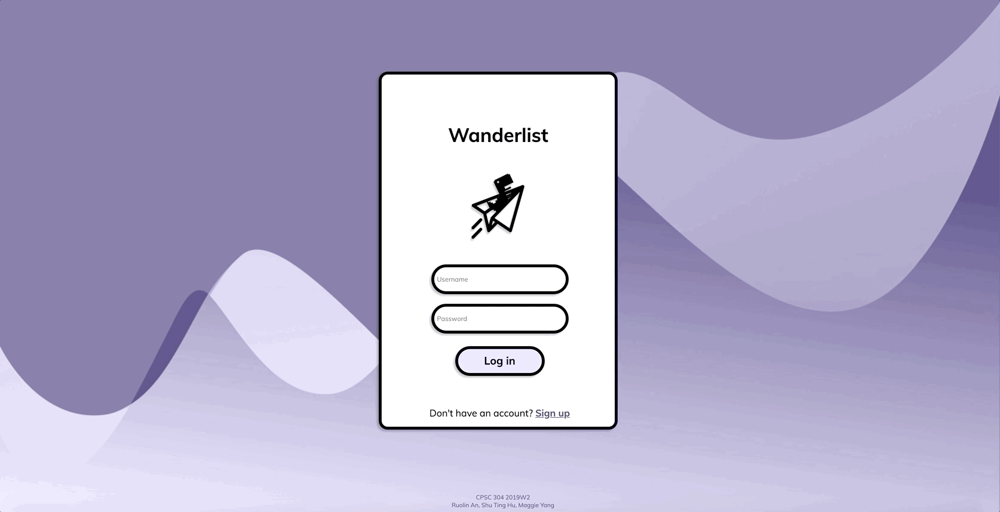
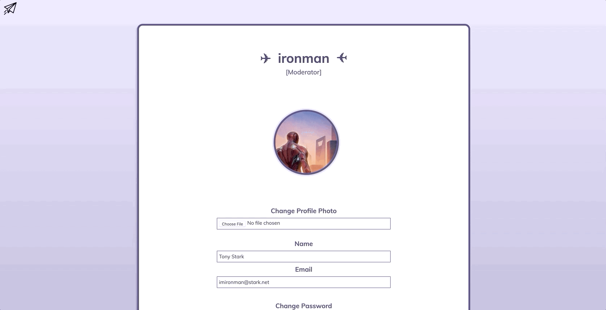

# Trip_Planning_Network

Welcome to __*Wanderlist*__, a travel planning && sharing social networking site!

:airplane: Made by Ruolin An, Shu Ting Hu and Maggie Yang for CPSC 304 2019W2

### Set up to run on your machine
1. Clone the repo.
2. Ensure XAMPP is set up properly. Use the instructions in Tutorial__PHP__MYSQL.pdf if you have not done so.
3. Create the advengers database in phpMyAdmin and populate it with tables and data using the advengers.sql script.
4. Drag the advengers folder into XAMPP/xamppfiles/htdocs.
5. Check the permissions on the file directories inside images: pfp and posts should have read write permissions for everyone, for all enclosed items.
6. Open localhost/advengers/login.html in your browser and have fun!

### Log In/Sign Up
Log in as an existing user or sign up for a free account. You can also log in as one of the existing users, the crew of advengers. Usernames can't be changed, so choose wisely!

### Home Page
Browse through the trip plans of your fellow advengers. Use the "Show Plan" button in the corner of each post to view itinerary details such as duration, attractions, activities, and restaurants. Search for users or locations, and hide or show location attributes as you prefer.

### Create Post
Feeling inspired? Create your own trip plan for a future adventure or reminisce and rave about a past one. Attach YouTube videos, photos, and reviews to share your experience - the more visual the better!

### Settings
Don't fret about forgotten passwords or regretful names. Update profile details in the Settings page such as display name, password, and profile picture.

### Admin Privileges
Moderate Wanderlist by deleting inappropriate users, or view special stats to track the growth of the site.

### Lost?
No worries! Board the paper plane with dino in the corner.

Enjoy!

*pssst see how many hidden dinos you can find around the webpage ;)*
